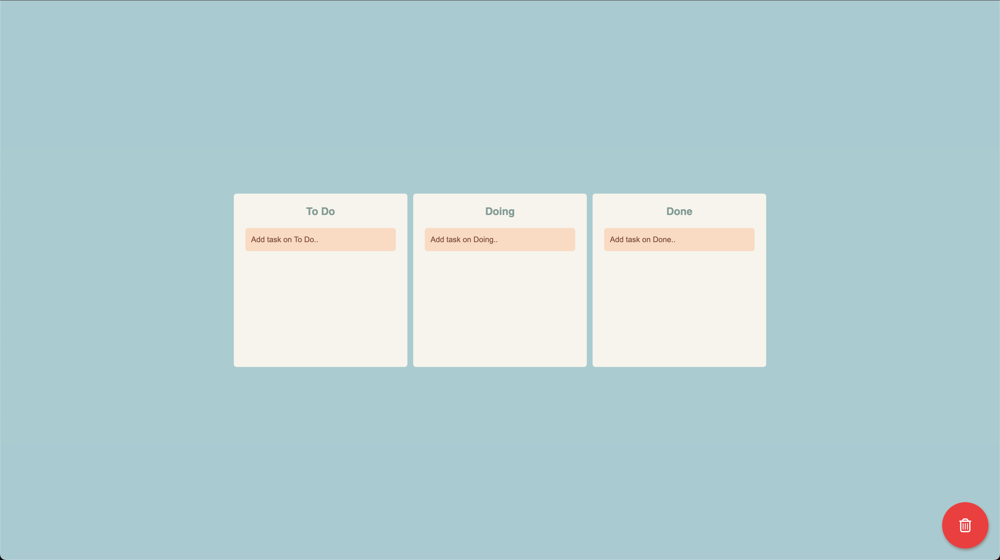

# 드래그 앤 드롭을 이용한 간단한 투두리스트



<br />

## 🏁 시작하기

배포 주소에 방문하거나,

파일을 저장한 후 다음의 명령어로 직접 프로젝트를 실행할 수 있습니다.

```zsh
npm install
npm start
```

<br />

## 🧐 프로젝트 소개

개발 기간 : 2023년 7월 26일

타입스크립트를 사용해본 첫 프로젝트입니다.

react-hook-form을 통해 투두를 입력받습니다.

투두는 recoil로 관리되며, 로컬스토리지에 저장됩니다.

react-beautiful-dnd를 사용하여 드래그 앤 드롭으로 투두의 위치를 변경할 수 있습니다.

오른쪽 하단에 위치한 휴지통 영역에 투두를 드래그하면 투두가 삭제됩니다.

### 기능

- 투두 입력 받기

- 투두 진행 상황 변경하기

- 투두 삭제하기

### 목적

- 타입스크립트에 익숙해지기 위해

- 다양한 라이브러리를 사용해보기 위해

- 프로젝트 리드미 작성 연습을 위해

<br />

## ⚙️ 기술 스택

### Config


### Development

<div style="display: flex; gap: 4px;">
  
  
  
  
  
  
  
</div>
